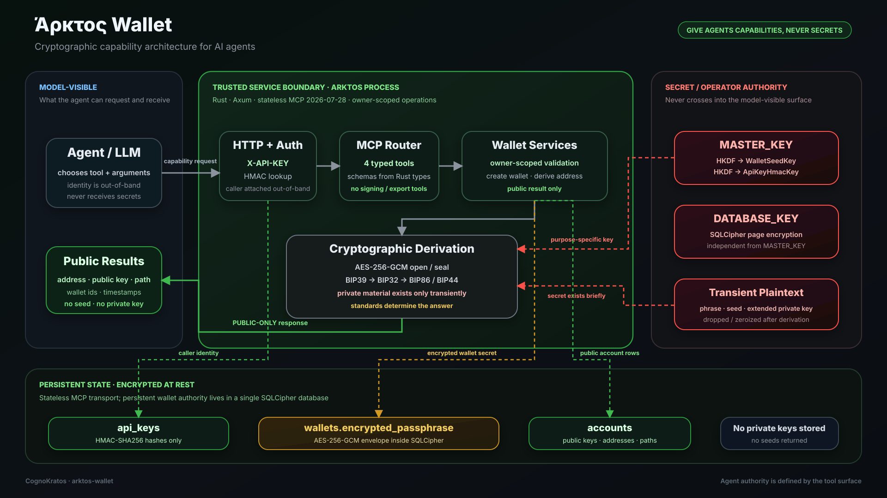

# Άρκτος Wallet

A **secure, self-hosted wallet capability service for AI agents**: an open-source, educational blueprint that lets agents create HD wallets and obtain Bitcoin and Ethereum addresses through MCP. The MCP surface never returns a recovery phrase, a seed or a private key, so the model never holds one.

> **Give agents capabilities, never secrets.**

Today an agent can create wallets and derive public addresses. The MCP surface has no tool to sign or broadcast transactions, sign messages, or export keys or seeds, so Arktos gives agents no authority to move value.

**Custody.** Wallet secrets are encrypted at rest under keys held by whoever operates the instance, and the service decrypts a recovery phrase briefly to derive an account. When the wallet owner runs Arktos and controls the keys, there is no third-party custodian. When one party operates Arktos for another, that operator has effective custody of the stored wallet secrets. The model never has custody: it receives no secret material.


## Where Arktos fits in CognoKratos

Arktos is **Part IV — Cryptographic Capability Engineering** in the current
[CognoKratos curriculum](https://github.com/cognokratos/.github/blob/main/CURRICULUM.md).
It asks how autonomous software can use cryptographic infrastructure without the
model becoming the holder of cryptographic authority.

This track deliberately stops before signing. That boundary is educational: it
lets the curriculum separate **public capability** from **authority to move
value** before exploring secure signing, delegated authority, settlement and
reconciliation as open research frontiers.

> **Core lesson:** Give agents capabilities, never secrets.

The repository is a laboratory, not a claim that one custody model is universally correct. Read the [CognoKratos foundation](https://github.com/cognokratos/.github/blob/main/FOUNDATION.md), follow the structured synthesis in the [CognoKratos Book](https://book.cognokratos.com/part-4/introduction.html), or help [challenge and extend the curriculum](https://github.com/cognokratos/.github/blob/main/CONTRIBUTING.md).

## Architecture at a glance



The architectural boundary is the capability surface: the agent chooses a typed operation and receives public data, while caller identity, key hierarchy, encrypted wallet secrets and transient private material stay inside the trusted service/operator domain. See the [architecture overview](./docs/architecture-overview.md) for the diagram explained as a trust model.

## 🎯 What is Arktos Wallet?

Arktos Wallet is a reference implementation that showcases best practices for:

- **Secure Wallet Management**: Self-hosted wallet creation with BIP39/BIP32 cryptographic standards; whoever operates the instance holds the keys
- **Multi-Account Support**: Manage multiple blockchain accounts under a single system owner
- **Modern MCP**: Stateless [MCP `2026-07-28`](https://modelcontextprotocol.io/specification/2026-07-28) server built on the official `rmcp` 3.x SDK
- **API Key Authentication**: MCP access protected by per-client API keys; wallets are scoped to the key
- **Data Encryption**: SQLCipher database encryption plus AES-256-GCM field encryption of wallet secrets with HKDF-separated keys
- **Docker Deployment**: Multi-stage Docker builds for lean, production-ready containerization
- **Extensibility**: Designed as a customizable foundation for builders and system owners

## 🎓 Learn

Arktos is one laboratory in the living CognoKratos curriculum:

| Track | Engineering question |
|---|---|
| [Part I — Production Agent Engineering](https://github.com/cognokratos/simple-agent-template) | How do we build and bound an agent around an untrusted probabilistic component? |
| [Part II — Durable Agent Runtime Engineering](https://github.com/cognokratos/sophos-agent) | How does an agent survive time, crashes and replay? |
| [Part III — Governed Decision Engineering](https://github.com/cognokratos/etf-research-agent) | How do deterministic policy and human authority constrain probabilistic reasoning? |
| **Part IV — Cryptographic Capability Engineering** | **How can an agent request cryptographic capabilities without becoming custodian of the secrets behind them?** |
| [Part V — Agentic Financial Workflow Engineering](https://github.com/cognokratos/tauros-revenue) | How can agents do financial work while humans retain financial authority? |

The Arktos track covers key hierarchies, versioned envelopes, secret lifetimes, deterministic derivation, out-of-band identity, least-capability tools and recovery, all grounded in this codebase. Start with the [secret lifecycle walkthrough](./docs/capability/SECRET-LIFECYCLE-WALKTHROUGH.md) if you have 30 minutes.

## 🚀 Quick Start

### Prerequisites
- [rustup](https://rustup.rs/) — the Rust toolchain (currently 1.97.1, 2024 edition) is pinned in [`rust-toolchain.toml`](./rust-toolchain.toml) and installed automatically
- A C toolchain, `make` and `perl` (SQLCipher and OpenSSL are built from source; no system SQLite needed)
- Docker (for containerized deployment)

### Development Setup
```bash
git clone <repository-url>
cd arktos-wallet
cargo build
cargo test
cargo run
```

Run `make ci` for the full set of local checks (formatting, Clippy, tests, `cargo audit`, `cargo deny`). See [CONTRIBUTING.md](./CONTRIBUTING.md) for the required tools.

For detailed development instructions, see [Development Guide](./docs/development-guide.md).

### Connecting an MCP client

Point a client that supports MCP `2026-07-28` at `http://localhost:8080/mcp` and send a client API key (created via `POST /admin/api-keys`) in the `X-API-KEY` header. Arktos only speaks `2026-07-28`: there is no `initialize` handshake or session, and clients discover the server with `server/discover`. See [API Contracts](./docs/api-contracts.md#2-mcp-entrypoint).

### Docker Deployment
```bash
docker build -t arktos-wallet:latest .
docker run -p 8080:8080 arktos-wallet:latest
```

For deployment details, see [Deployment Guide](./docs/deployment-guide.md).

## 📋 Core Features

- ✅ Wallet creation with secure recovery passphrases
- ✅ Bitcoin Taproot addresses (BIP39 + BIP32 + BIP86) on a configurable network (`mainnet`, `testnet`, `signet`, `regtest`)
- ✅ Ethereum addresses (BIP39 + BIP32, BIP44 path) with EIP-55 checksums and a configured chain ID
- ✅ Structured, schema-described MCP results and typed error codes
- ✅ Multi-account management per wallet
- ✅ Encrypted SQLite database with SQLCipher, versioned migrations and enforced constraints
- ✅ Stateless MCP `2026-07-28` HTTP endpoint (`server/discover`, no sessions) with API key authentication
- ✅ Liveness (`/healthz`) and readiness (`/readyz`) endpoints
- ✅ Structured operation logging (tool, API-key id, wallet id, public addresses; never secrets)
- ✅ Stateless MCP protocol layer (persistent wallet data in a local, single-instance SQLCipher database)

## 📚 Documentation

### Learn
- **[Cryptographic Capability Learning Path](./docs/CRYPTOGRAPHIC-CAPABILITY-LEARNING-PATH.md)** - Lessons C1–C8, secret lifecycle walkthrough, case studies and challenges

### Project Overview
- **[Project Overview](./docs/project-overview.md)** - High-level introduction and technology stack
- **[Architecture Overview](./docs/architecture-overview.md)** - Visual trust and capability model
- **[Architecture](./docs/architecture.md)** - System design, patterns, and technical decisions

### Development & Deployment
- **[Development Guide](./docs/development-guide.md)** - Setup, building, testing, and local development
- **[Deployment Guide](./docs/deployment-guide.md)** - Containerization, environment configuration, and production deployment

### API & Data
- **[API Contracts](./docs/api-contracts.md)** - HTTP endpoints and MCP tools specification
- **[Data Models](./docs/data-models.md)** - Database schema, wallet structure, and account management

### Extensibility
- **[Customization Guide](./docs/customization-guide.md)** - Adding new blockchain support, custom authentication, and feature extension patterns
- **[Regional Compliance](./docs/regional-compliance.md)** - Adapting Arktos for compliance requirements and privacy regulations

For a complete documentation index, see [Documentation Index](./docs/index.md).

## 🔧 Customization for Your Needs

Arktos is designed as a **customizable blueprint**. System owners can adapt it for specific requirements:

### Add New Blockchain Support
Extend the architecture to support additional blockchains (e.g., Solana, Polkadot) by implementing custom key derivation modules. See [Customization Guide](./docs/customization-guide.md#1-adding-blockchain-support) for patterns and examples.

### Integrate Custom Authentication
Replace API key authentication with your identity provider (e.g., OAuth2, JWT, mTLS). The modular security layer allows seamless substitution. See [Customization Guide](./docs/customization-guide.md#2-custom-authentication).

### Adapt for Regional Compliance
The architecture includes encryption and audit-oriented patterns that can be adapted to organizational or regional requirements. See [Regional Compliance](./docs/regional-compliance.md) for design considerations; the project itself is not a compliance certification.

### Customize Database & Storage
SQLite + SQLCipher is the intended storage for a self-hosted, single-instance deployment. Persistence is isolated in `Database`, `KeyStore` and `WalletStore`, so another backend can replace them while keeping the same API contract.

## 🔐 Security & Privacy

- **Two Independent Encryption Layers**: SQLCipher encrypts the database file (`DATABASE_KEY`); recovery phrases are additionally encrypted with AES-256-GCM under keys derived from `MASTER_KEY` via HKDF-SHA256, so database access alone does not reveal them
- **Key Separation**: API-key hashing and seed encryption each use their own derived key; generate secrets with `make secret`
- **No Private-Key Storage**: only the encrypted recovery phrase is persisted; account private keys exist only in memory during one derivation and are never stored or returned
- **Secret Hygiene**: Arktos-owned secret buffers are zeroized after use; library-internal copies are outside its control. The server never logs wallet secrets or returns them through MCP or the admin API. Memory secrecy is best-effort, not absolute
- **Secure Communication**: Terminate TLS 1.2+ in front of Arktos (it serves plain HTTP)
- **API Key Management**: Only HMAC-SHA256 hashes of API keys are stored
- **Operation Logging**: Tool calls and wallet operations are logged with API-key ids and public data only
- **Operator Custody**: The operator holds `MASTER_KEY` and `DATABASE_KEY`, and the running service decrypts a recovery phrase transiently to derive an account. Self-hosting by the wallet owner means no third-party custodian; operating Arktos for someone else makes the operator their custodian. Operator tooling (`make decrypt`) can deliberately decrypt a stored phrase; agents have no such capability

For security details, see [Architecture — Key Hierarchy & Secret Storage](./docs/architecture.md#key-hierarchy--secret-storage).

## 📊 Performance Targets

These are design targets (non-functional requirements), not benchmarked results. Only address retrieval has an automated check: an in-process smoke test (`test_get_bitcoin_address_performance_requirement` in `tests/integration_tests.rs`). No load or capacity benchmarks are published.

- **Wallet Creation**: < 500ms (p95)
- **Address Retrieval**: < 100ms (p95)
- **Concurrency**: 100+ req/s (single instance)
- **Database Capacity**: 10,000 wallets, 50,000+ accounts
- **Uptime**: 99.9% (production deployment)

## 🛠️ Technology Stack

| Component | Technology | Version | Purpose |
|-----------|-----------|---------|---------|
| Language | Rust | 1.97 (2024 edition) | Type-safe, high-performance backend |
| Web Framework | Axum | 0.8+ | Async HTTP server |
| Async Runtime | Tokio | 1.x | Non-blocking I/O |
| Database | SQLite + SQLCipher | 3.x | Encrypted local persistence |
| Protocol | MCP (Model Context Protocol) | spec `2026-07-28`, rmcp 3.x | AI agent integration (stateless HTTP) |
| Cryptography | secp256k1, bip39, bip32 | Latest | Blockchain standards |
| Serialization | Serde | 1.x | Data encoding (JSON, binary) |

## 🤝 Contributing

Arktos Wallet is an open-source educational project. Contributions, forks, and adaptations are encouraged.

For the CognoKratos curriculum, especially valuable contributions include new adversarial cases, stronger custody/threat models, alternative secret-lifecycle designs, experiments around revocation, or research prototypes for secure signing and delegated authority that make their assumptions explicit.

- **For enhancements**: Open issues and pull requests — see [CONTRIBUTING.md](./CONTRIBUTING.md)
- **For curriculum contributions**: See the organization-level [CognoKratos contribution model](https://github.com/cognokratos/.github/blob/main/CONTRIBUTING.md)
- **For security issues**: Report privately as described in [SECURITY.md](./SECURITY.md); do not open public issues
- **For custom implementations**: This repository serves as a reference—fork and adapt it to your specific needs

## 📝 License

The original code and documentation in this repository are released under the [MIT License](LICENSE) (Copyright (c) 2026 Victor Nitu). The banner image (`docs/bg.png`) is a project brand asset and is not covered by the MIT grant. Dependencies are used under their own licences; `deny.toml` lists the licences the dependency tree may use. The crate stays `publish = false`: that prevents accidental publication to crates.io and is not a licence setting.

## 🆘 Support & Community

- **Documentation**: See [docs/](./docs/) for comprehensive guides
- **Issues**: Report bugs or request features via GitHub Issues
- **Discussions**: Join discussions for implementation patterns and architectural questions
- **Book**: Read [Part IV — Cryptographic Capability Engineering](https://book.cognokratos.com/part-4/introduction.html)

---

**Arktos Wallet is a blueprint—not a one-size-fits-all solution. Inspect it, challenge it, and extend the curriculum where its boundaries stop.**
