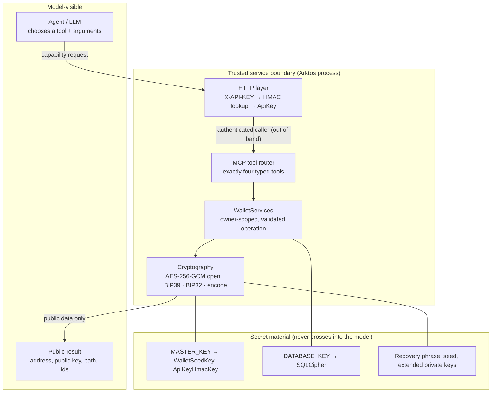

# Cryptographic capability learning path: from agent to cryptographic actor

> Arktos is not a course in blockchain basics.
>
> It is a course in safely exposing cryptographic capabilities to software agents.

The principle the whole path is built on:

> **Give agents capabilities, never secrets.**

The question it answers:

> **How do you let probabilistic software request cryptographic operations without making the model the custodian of cryptographic authority?**

It is written for experienced software engineers. It assumes you can read Rust, and that you know HTTP, APIs, databases, authentication, Docker, the basic vocabulary of cryptography (hashes, MACs, symmetric encryption, KDFs, elliptic-curve keys) and what an MCP tool call is. It does not explain what an LLM, Bitcoin or AES is. It explains a primitive only where its *engineering consequences* shape the design.

## Where this fits

The CognoKratos projects are four distinct tracks. Each one answers a different question about the same kind of system:

```text
simple-agent-template      Production Agent Engineering
    teaches how to engineer the agent
        ↓
sophos-agent               Durable Agent Runtime Engineering
    teaches how to engineer the runtime
        ↓
etf-research-agent         Governed Decision Engineering
    teaches how to govern decisions
        ↓
arktos-wallet              Cryptographic Capability Engineering
    teaches how to expose cryptographic authority safely
```

The order is conceptual, not mandatory. You can start here if you already know what an agent loop and an MCP tool are. Arktos does not re-teach those topics. When a lesson depends on one, it links to the track that covers it:

| Topic | Taught in |
|---|---|
| Agent loops, ReAct, native tool calling | [simple-agent-template, stages 1–2](https://github.com/cognokratos/simple-agent-template/blob/main/docs/LEARNING-PATH.md#stage-1-agent-and-agent-loop) |
| MCP fundamentals, tools as capability boundaries | [simple-agent-template, stage 3](https://github.com/cognokratos/simple-agent-template/blob/main/docs/LEARNING-PATH.md#stage-3-mcp-and-capability-boundaries) |
| Guardrails, untrusted data, prompt injection | [simple-agent-template, stage 5](https://github.com/cognokratos/simple-agent-template/blob/main/docs/LEARNING-PATH.md#stage-5-guardrails-and-untrusted-data) |
| Authentication, identity and trust boundaries in general | [simple-agent-template, stage 8](https://github.com/cognokratos/simple-agent-template/blob/main/docs/LEARNING-PATH.md#stage-8-authentication-identity-and-trust-boundaries) |
| Human-in-the-loop mechanics, approval tokens | [simple-agent-template, stage 9](https://github.com/cognokratos/simple-agent-template/blob/main/docs/LEARNING-PATH.md#stage-9-human-in-the-loop-and-controlled-mutations) |
| Durable execution, checkpoints, crash/resume, idempotent side effects | [sophos-agent runtime path](https://github.com/cognokratos/sophos-agent/blob/main/docs/RUNTIME-LEARNING-PATH.md) |
| Deterministic policy, evidence contracts, consent for consequential decisions | [etf-research-agent applied path](https://github.com/cognokratos/etf-research-agent/blob/main/docs/APPLIED-LEARNING-PATH.md) |

What Arktos teaches, and the others do not: **cryptographic authority, secret containment and capability design for systems that agents can call.**

## What Arktos is, precisely

Arktos is one Rust process (Axum + Tokio) that serves:

- a stateless MCP `2026-07-28` endpoint at `/mcp`, authenticated with a per-client API key in the `X-API-KEY` header;
- an admin REST API at `/admin/api-keys`, authenticated with `ADMIN_API_KEY`;
- liveness and readiness probes.

State lives in one local SQLCipher database. The MCP tool surface is exactly four tools:

| Tool | What it does |
|---|---|
| `ping` | Returns `"pong"` |
| `create_wallet` | Generates a 12-word BIP39 recovery phrase, encrypts it, stores it under the caller's API key |
| `get_bitcoin_address` | Returns (deriving and recording on first use) a BIP86 Taproot address |
| `get_ethereum_address` | Returns (deriving and recording on first use) a BIP44 Ethereum address, EIP-55 checksummed |

Arktos does **not** sign transactions, broadcast transactions, sign arbitrary messages, export private keys, export seeds, read balances or talk to any blockchain node. The service never gives an agent the ability to move value. Wherever this path discusses signing, it is labelled **future design**.

Several properties of the current system are easy to overstate, so here they are exactly:

- **Custody.** Arktos is self-hosted. The operator holds `MASTER_KEY` and `DATABASE_KEY`, so no third party is a custodian. The service itself *does* decrypt recovery phrases, briefly, to derive accounts. From the point of view of an API client or an agent, the operator's Arktos instance is the custodian.
- **Private keys.** Account private keys exist in process memory for the duration of one derivation. They are **not persisted and not returned**. They do exist.
- **Statelessness.** The **MCP protocol layer** is stateless: there are no sessions. **Wallet and application state is persistent**, and the SQLCipher deployment is single-instance per database.

## The authority flow

Every lesson refers back to this boundary:



The model selects an operation. It never holds a key, never supplies its identity, and never receives secret material.

## The path at a glance

| Stage | Question | Core lesson | Lesson |
|---|---|---|---|
| C1 | What authority does the agent actually have? | Capabilities define the threat model | [01 — Model cryptographic authority](capability/01-model-cryptographic-authority.md) |
| C2 | How are secrets separated? | Key hierarchy and domain separation | [02 — Design key hierarchies](capability/02-design-key-hierarchies.md) |
| C3 | How should encrypted data survive change? | Versioned authenticated encryption | [03 — Encryption is a data format](capability/03-encryption-is-a-data-format.md) |
| C4 | Where may plaintext secrets exist? | Secret lifetime minimization | [04 — Minimize secret lifetimes](capability/04-minimize-secret-lifetimes.md) |
| C5 | What should be deterministic? | Standards-based key and address derivation | [05 — Derive, don't invent](capability/05-derive-dont-invent.md) |
| C6 | Who owns which resources? | Authenticated caller scope | [06 — Bind identity to capability](capability/06-bind-identity-to-capability.md) |
| C7 | What should the agent be allowed to invoke? | Least-capability tool design | [07 — Design least-capability tools](capability/07-design-least-capability-tools.md) |
| C8 | Can the owner recover safely? | Backup, recovery, rotation, migration | [08 — Recovery is part of security](capability/08-recovery-is-part-of-security.md) |
| ★ | How would transaction signing change the entire authority model? | Future design | [Challenges](capability/CHALLENGES.md) |

Then follow one wallet secret from OS entropy to a public address in the [secret lifecycle walkthrough](capability/SECRET-LIFECYCLE-WALKTHROUGH.md), read why the architecture looks the way it does in the [case studies](capability/CASE-STUDIES.md), and test yourself with the [challenges](capability/CHALLENGES.md).

## How long things take

| In | You can | Read |
|---|---|---|
| 5 minutes | State what an agent can and cannot do through Arktos | This page, [lesson 01's authority table](capability/01-model-cryptographic-authority.md#the-current-authority-surface) |
| 30 minutes | Explain where every wallet secret lives and for how long | [Secret lifecycle walkthrough](capability/SECRET-LIFECYCLE-WALKTHROUGH.md) |
| An afternoon | Run every test-based experiment in C1–C5 | Lessons 01–05; only `cargo` needed |
| A day | Run the live labs in C6–C8 against a local server, then attempt a challenge | Lessons 06–08 with the [lab setup](#lab-setup), [challenges](capability/CHALLENGES.md) |

## Stage summaries

Each stage lists the question it asks, the files to read, an experiment, the failure mode it prevents, the takeaway, the related reference documentation and, where it applies, the upstream prerequisite.

### C1 — What authority does the agent actually have?

- **Implementation:** [`src/mcp.rs`](../src/mcp.rs), [`src/wallet_services.rs`](../src/wallet_services.rs), [`src/error.rs`](../src/error.rs)
- **Experiment:** list the tools and their schemas (`cargo test --test mcp_protocol_tests tools_list_exposes_wallet_tools_deterministically`). Then classify each tool by whether it reads a secret, creates state, returns a secret or carries financial authority.
- **Failure mode:** treating a new tool as "just another endpoint", when it is really a transfer of authority to a probabilistic caller.
- **Takeaway:** every tool is an authority grant.
- **Reference:** [API Contracts — MCP Tools](api-contracts.md#mcp-tools)
- **Upstream:** [template stage 3 — MCP and capability boundaries](https://github.com/cognokratos/simple-agent-template/blob/main/docs/LEARNING-PATH.md#stage-3-mcp-and-capability-boundaries)

### C2 — How are secrets separated?

- **Implementation:** [`src/keys.rs`](../src/keys.rs), [`src/config.rs`](../src/config.rs), [`src/database.rs`](../src/database.rs)
- **Experiment:** `cargo test --lib keys::tests`. These tests show that derivation is deterministic, that purposes are independent, and that a relabelled key cannot open existing ciphertext.
- **Failure mode:** one key used for two purposes, or an innocent-looking label rename that makes every stored wallet unreadable.
- **Takeaway:** cryptographic naming is part of persistent protocol design.
- **Reference:** [Architecture — Key Hierarchy & Secret Storage](architecture.md#key-hierarchy--secret-storage)

### C3 — How should encrypted data survive change?

- **Implementation:** [`src/crypto.rs`](../src/crypto.rs)
- **Experiment:** `cargo test --lib crypto::tests`. The tests tamper with the nonce, the ciphertext, `alg` and `v`, and try a key with a different purpose; check which error class each change produces.
- **Failure mode:** unversioned ciphertext that cannot be migrated, or error messages that tell an attacker *why* decryption failed.
- **Takeaway:** ciphertext is long-lived structured data. Design it like a versioned protocol.
- **Reference:** [Architecture — Key Hierarchy & Secret Storage](architecture.md#key-hierarchy--secret-storage), [Data Models — Encryption](data-models.md#encryption)

### C4 — Where may plaintext secrets exist?

- **Implementation:** [`src/wallet_manager.rs`](../src/wallet_manager.rs), [`src/wallet_services.rs`](../src/wallet_services.rs)
- **Experiment:** trace one first-use `get_ethereum_address` call and mark every point where plaintext secret material exists. Then trace a repeat call and notice that no secret is touched at all.
- **Failure mode:** confusing *using* a secret with *disclosing* it, or believing that zeroization gives perfect memory secrecy.
- **Takeaway:** secret use and secret disclosure are different operations.
- **Reference:** [Architecture — Key Hierarchy & Secret Storage](architecture.md#key-hierarchy--secret-storage)

### C5 — What should be deterministic?

- **Implementation:** [`src/domain.rs`](../src/domain.rs), [`src/wallet_manager.rs`](../src/wallet_manager.rs), [`migrations/V2__account_network.sql`](../migrations/V2__account_network.sql)
- **Experiment:** `cargo test --lib wallet_manager::tests` (published BIP86/BIP44/EIP-55 vectors). Then switch `BITCOIN_NETWORK` and `ETHEREUM_CHAIN_ID` on a live server and predict what changes.
- **Failure mode:** letting a model produce or "remember" an address, a path or a checksum that a standard defines exactly.
- **Takeaway:** if a standard defines the answer deterministically, don't delegate it to a probabilistic system.
- **Reference:** [API Contracts — `get_bitcoin_address`](api-contracts.md#get_bitcoin_address), [Data Models — `accounts`](data-models.md#accounts)

### C6 — Who owns which resources?

- **Implementation:** [`src/auth.rs`](../src/auth.rs), [`src/mcp.rs`](../src/mcp.rs), [`src/wallet_store.rs`](../src/wallet_store.rs)
- **Experiment:** create two API keys and have each one create a wallet called `main`. Derive addresses with both, then try to reach one owner's wallet with the other owner's key.
- **Failure mode:** identity supplied as a tool argument, or a lookup by name followed by an ownership check that someone eventually forgets.
- **Takeaway:** credentials belong in trusted transport context, not in model-visible tool arguments.
- **Reference:** [Architecture — Authentication & Authorization](architecture.md#authentication--authorization)
- **Upstream:** [template stage 8 — identity and trust boundaries](https://github.com/cognokratos/simple-agent-template/blob/main/docs/LEARNING-PATH.md#stage-8-authentication-identity-and-trust-boundaries)

### C7 — What should the agent be allowed to invoke?

- **Implementation:** [`src/wallet_services.rs`](../src/wallet_services.rs) (request/response types), [`src/mcp.rs`](../src/mcp.rs)
- **Experiment:** inspect the generated input and output schemas (`cargo test --test mcp_protocol_tests tools_publish_input_and_output_schemas`). Then design `prove_ownership` both as `export_private_key` and as `sign_challenge`, and compare the two.
- **Failure mode:** a generic `wallet_execute(operation, payload)` tool whose real authority is far broader than its name suggests.
- **Takeaway:** capability design is more important than prompt design when agents can act.
- **Reference:** [API Contracts — Conventions](api-contracts.md#conventions)
- **Upstream:** [template stage 5 — guardrails and untrusted data](https://github.com/cognokratos/simple-agent-template/blob/main/docs/LEARNING-PATH.md#stage-5-guardrails-and-untrusted-data)

### C8 — Can the owner recover safely?

- **Implementation:** [`src/database.rs`](../src/database.rs), [`src/config.rs`](../src/config.rs), [`tests/secret_storage_tests.rs`](../tests/secret_storage_tests.rs)
- **Experiment:** build a recovery inventory. Restart a lab server with a replacement `MASTER_KEY` and observe what still works, what stops working, and what keeps working even though it should worry you.
- **Failure mode:** encryption without a recovery plan, which turns a security control into permanent data loss.
- **Takeaway:** encryption without recoverability can become data loss.
- **Reference:** [Architecture — Files, Permissions and Backups](architecture.md#files-permissions-and-backups), [Deployment Guide — Persistence](deployment-guide.md#persistence)
- **Upstream:** [sophos-agent runtime path](https://github.com/cognokratos/sophos-agent/blob/main/docs/RUNTIME-LEARNING-PATH.md) for durability in general

### ★ Future design — How would transaction signing change the entire authority model?

Signing would add very little API surface: one tool. It would change the threat model far more than that. Signing turns a prompt-injected tool call from "the agent received a wrong address" into "value left the wallet". It introduces replay, chain identity, policy over destination and value, and human consent as hard requirements. Work through it in [Challenge 1](capability/CHALLENGES.md#challenge-1--design-safe-transaction-signing), after the [capability escalation ladder](capability/01-model-cryptographic-authority.md#the-capability-escalation-ladder) in lesson 01. For consent and governed decisions, see the [etf-research-agent applied path](https://github.com/cognokratos/etf-research-agent/blob/main/docs/APPLIED-LEARNING-PATH.md), which treats that problem in depth.

## Recurring principles

These come up in every lesson:

> Give agents capabilities, never secrets.

> Every tool is an authority grant.

> Credentials belong outside model-visible tool arguments.

> Deterministic cryptography should remain deterministic.

> The safest private key is often the one you never persist.

> Key names, purpose labels and envelope versions are persistent protocol design.

> Encryption without recoverability can become data loss.

> Protocol statelessness does not imply application statelessness.

> A future signing tool changes the threat model much more than it changes the API surface.

## Lab setup

Lessons 01–05 need only `cargo`, because their experiments are tests. Lessons 06–08 use a throwaway local server. Run the labs with **lab keys in a scratch directory** and never against a database that holds real wallets.

```bash
# A scratch location, separate from data/ and from any .env you use.
export LAB=$(mktemp -d)
export DATABASE_PATH="$LAB/arktos.db"
export ADMIN_API_KEY=lab-admin
export MASTER_KEY=$(make secret)       # two independent values; never reuse
export DATABASE_KEY=$(make secret)

cargo run --quiet --bin arktos-wallet  # leave running; use a second shell below
```

In a second shell with the same exported variables, create API keys and define a tiny raw MCP helper. Real agents use an MCP client. The helper shows exactly what goes over the wire: the API key travels in a header, and the tool arguments carry no identity.

```bash
new_key() {  # usage: new_key <name>  → prints a new client API key (lab only)
  curl -s -X POST http://localhost:8080/admin/api-keys \
    -H "X-API-KEY: $ADMIN_API_KEY" -H 'Content-Type: application/json' \
    -d "{\"name\":\"$1\"}" | python3 -c 'import sys, json; print(json.load(sys.stdin)["api_key"])'
}

mcp() {  # usage: mcp <api-key> <tool> '<json arguments>'
  curl -s http://localhost:8080/mcp \
    -H "X-API-KEY: $1" \
    -H 'Content-Type: application/json' \
    -H 'Accept: application/json, text/event-stream' \
    -H 'MCP-Protocol-Version: 2026-07-28' \
    -H 'Mcp-Method: tools/call' -H "Mcp-Name: $2" \
    -d '{"jsonrpc":"2.0","id":1,"method":"tools/call","params":{"name":"'"$2"'","arguments":'"$3"',"_meta":{"io.modelcontextprotocol/protocolVersion":"2026-07-28","io.modelcontextprotocol/clientInfo":{"name":"lab","version":"1"},"io.modelcontextprotocol/clientCapabilities":{}}}}'
  echo
}

A=$(new_key agent-a)
B=$(new_key agent-b)
mcp "$A" ping '{}'
```

The helper puts a lab API key on a `curl` command line, where other local users can see it in the process list. That is acceptable for a throwaway key. It is not acceptable for a real one.

The labs inspect the database through the `sqlcipher` shell. If you use `make sql`, be aware that the Makefile reads `.env` if one exists, and `.env` values take precedence over your exported lab variables. Either run the labs from a checkout without `.env`, or open the shell directly:

```bash
labsql() {  # usage: labsql "<SQL>"   (key passed via an owner-only temp file, not argv)
  init=$(mktemp); chmod 600 "$init"
  printf "PRAGMA key = '%s';\n" "$(printf '%s' "$DATABASE_KEY" | sed "s/'/''/g")" > "$init"
  sqlcipher -init "$init" "$DATABASE_PATH" "$1"; rm -f "$init"
}
```

None of the labs prints a recovery phrase, a seed or a private key. Some operator tooling *can* print a recovery phrase (`make decrypt`), and the labs deliberately never use it. [Lesson 07](capability/07-design-least-capability-tools.md#the-operator-has-capabilities-the-agent-does-not) explains why that tool exists outside the agent surface.

## Verifying the learning material

`make docs-check` checks every relative link, heading anchor, referenced repository path and `make` target in the Markdown documentation. It runs offline and is part of `make ci`.
