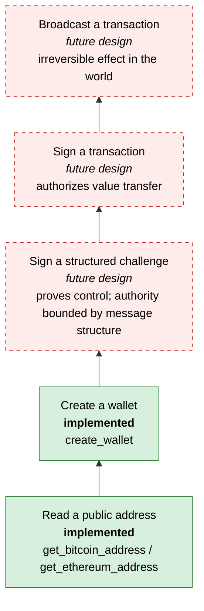

# C1 — Model cryptographic authority

> **Every tool is an authority grant.**

**Question:** what can an agent actually *do* through Arktos, and what would it be able to do if one more tool were added?

**Prerequisite:** you know what an MCP tool is and why a tool list is a capability boundary. If not, read [simple-agent-template stage 3](https://github.com/cognokratos/simple-agent-template/blob/main/docs/LEARNING-PATH.md#stage-3-mcp-and-capability-boundaries) first. This lesson starts where that one stops, at the point where the capability is cryptographic.

## Mental model

A threat model for an agent-accessible system does not start with the attacker. It starts with the **capability surface**: the complete set of operations a caller can invoke, and what each one lets the caller cause.

When the caller is a model, three things are true at once:

1. The model is **probabilistic**. With some probability it will call the wrong tool, with the wrong arguments, at the wrong time.
2. The model is **steerable by its inputs**. Any text it reads, including web pages, emails and tool results, can try to make it call a tool ([prompt injection](https://github.com/cognokratos/simple-agent-template/blob/main/docs/LEARNING-PATH.md#stage-5-guardrails-and-untrusted-data)).
3. The model **holds whatever the tools return**. Anything in a tool result can end up in a log, a transcript, a later prompt or another tool's arguments.

So for each tool, ask: *if the worst plausible caller invoked this with the worst plausible arguments, what happens?* The answer to that question is the authority you have granted.

## The current authority surface

The complete agent surface is the `#[tool_router] impl McpServer` block in [`src/mcp.rs`](../../src/mcp.rs), which is marked `CAPABILITY-BOUNDARY` in the source. It has four tools. This table states exactly what each one does today:

| Tool | Touches secret material? | Creates state? | Returns secret material? | Financial authority? |
|---|---|---|---|---|
| `ping` | no | no | no | none |
| `create_wallet` | **yes**: generates a recovery phrase from OS entropy and seals it with `WalletSeedKey` | **yes**: one `wallets` row, owned by the caller's API key | no; returns `wallet_id`, `wallet_name`, `created_at` | none. It creates keys that *could later* receive funds, but there is no signing or spending path |
| `get_bitcoin_address` | **only on first use** of a (wallet, network, index): decrypts the phrase and derives transiently. Repeat calls read a public row and touch no secret | **first use only**: one `accounts` row | no; returns address, public key, path, network, index | none. It hands out a receive address |
| `get_ethereum_address` | same as above | same as above | same as above (address EIP-55 checksummed, configured chain ID reported) | none. It hands out a receive address |

Things the table does not show, but which you should notice:

- **"Touches secret material" and "returns secret material" are different columns.** Arktos's core design idea is that a tool can *use* a secret on the caller's behalf without *disclosing* it. [Lesson 04](04-minimize-secret-lifetimes.md) is built around this distinction.
- **Creating state is a kind of authority too.** `account_index` accepts any value in `0..=2^31-1`, and every new index adds a row. A looping or injected agent can therefore grow the database without bound. Nothing is lost when that happens, but it is still something the caller can *cause*. Whether to rate-limit it is a deployment decision.
- **A receive address is not harmless.** If an agent hands a payer an address from the wrong wallet, or from the right wallet on a network the payee does not expect, funds go somewhere the owner did not intend. Arktos limits the damage: derivation is deterministic, and the network comes from server configuration, not from the model. The *choice* of wallet name and index is still the model's.
- **Identity is not in the table, because it is not a tool argument.** None of the four tools accepts an API key, a wallet ID or an owner. [Lesson 06](06-bind-identity-to-capability.md) explains why that matters.

### What prompt injection can do today

Assume an attacker fully controls a document the agent reads, and the agent obeys it. Through Arktos the attacker can:

- create wallets and accounts under the victim's API key (state growth);
- make the agent reveal the victim's **public** addresses and public keys, which is a privacy loss if another tool exfiltrates them;
- make the agent return an address from a different wallet or index than the user asked for.

The attacker **cannot** obtain a recovery phrase, a seed or a private key, cannot move funds, and cannot reach another API key's wallets. The reason is not a better prompt. The reason is that no tool exists that would let them.

## Hypothetical capabilities

None of the following exists in Arktos. Each one is a **future design** thought experiment. For each, the question is: *what new authority appears?*

| Hypothetical tool | New authority | Secret exposure | Prompt injection becomes… | Human approval? | Replay / idempotency | Policy needed over… |
|---|---|---|---|---|---|---|
| `export_seed` | Total and permanent control of every account in the wallet, on every chain, forever | **The root secret enters model context** and every log, transcript and cache it touches | Catastrophic and irreversible: one injected call is enough | No approval makes this safe for an agent. It belongs to an offline owner ceremony, if anywhere | Irrelevant, because the first disclosure is final | n/a. Do not build it as a tool |
| `derive_private_key(wallet, index)` | Control of one account, and in combination possibly more (see [lesson 07](07-design-least-capability-tools.md#composition-can-exceed-the-sum-of-the-parts)) | A value-bearing private key enters model context | Catastrophic for that account | Same as above | Irrelevant | n/a |
| `sign_message(wallet, bytes)` | Whatever any verifier accepts that signature for: logins, attestations, and potentially transactions if the bytes are a transaction | None directly, but a signature *is* authority | Severe: the attacker chooses the bytes | Depends on structure. Raw bytes cannot be judged | Matters: signatures can be replayed | Message domain, audience, expiry |
| `sign_transaction(wallet, tx)` | Moving value, once broadcast by anyone | None directly | Theft | Yes, for anything above a policy threshold | Chain nonce, EIP-155 chain ID, duplicate requests | Destination, value, chain, fees, rate |
| `broadcast_transaction(raw_tx)` | Publishing an already-authorized transfer; irreversible on confirmation | None | Turns any leaked signed transaction into a completed transfer | If combined with signing, yes | Must be idempotent: rebroadcast should not double-act | Which network endpoint, and whether the transaction came from this system |

Patterns to take away from the table:

- **Disclosure tools** (`export_seed`, `derive_private_key`) move the secret across the model boundary. After that, the model and everything downstream of it hold the authority, and nothing can take it back.
- **Use tools** (`sign_*`) keep the secret inside the service, but each call *exercises* authority. They are only as safe as the structure, policy and consent placed around each invocation.
- **Effect tools** (`broadcast_*`) are where authority becomes irreversible in the outside world.

Approval tokens, consent records and governed decisions are taught elsewhere. See [template stage 9](https://github.com/cognokratos/simple-agent-template/blob/main/docs/LEARNING-PATH.md#stage-9-human-in-the-loop-and-controlled-mutations) for HITL mechanics and the [etf-research-agent consent lesson](https://github.com/cognokratos/etf-research-agent/blob/main/docs/applied/05-recommendation-authority-and-consent.md) for recommendation versus authorization. The point here is the step before either of those: deciding which authority exists at all.

## The capability escalation ladder



Each rung up adds authority and adds requirements: structure, policy, consent, replay protection and audit. **Arktos stops at the second rung.** The dashed rungs do not exist.

## Experiments

### Observe: the exact tool surface

```bash
cargo test --test mcp_protocol_tests tools_list_exposes_wallet_tools_deterministically
cargo test --test mcp_protocol_tests tools_publish_input_and_output_schemas
```

Read both tests in [`tests/mcp_protocol_tests.rs`](../../tests/mcp_protocol_tests.rs). The first pins the tool list. The second checks that each tool publishes an input schema and an output schema. Neither schema contains an identity field or a secret field.

### Predict, then inspect: what does `create_wallet` return?

Before you look, write down every field you think `create_wallet` returns. Then read `CreateWalletResponse` in [`src/wallet_services.rs`](../../src/wallet_services.rs) and run:

```bash
cargo test --test mcp_protocol_tests responses_contain_no_secret_fields
```

That test fails if any structured result has a field whose name contains `mnemonic`, `passphrase`, `seed`, `private_key` or similar. It also decodes each result with `deny_unknown_fields`, so a field beyond the contract would be caught too.

### Break (on paper): add one tool

Pick one row from the hypothetical table. Write the `#[tool]` signature you would add to `McpServer`. Then answer:

1. Which column of the *current* authority table changes for that tool?
2. Which of the three prompt-injection outcomes above becomes worse, and how much worse?
3. Can you still answer "what is the worst a fully injected agent can do?" in one sentence?

If question 3 now needs a paragraph, your threat model has changed far more than your API has.

### Explain

`create_wallet` generates secret material, and its result contains none. `get_*_address` uses secret material, and its result contains none. Write one sentence on why "touches a secret" and "returns a secret" must be designed as separate properties of a tool.

## Failure mode

Treating tools as API features ("we just need a `sign` endpoint") and not as authority grants. The API diff looks small. The threat-model diff is the difference between "an agent can learn your address" and "an agent can spend your money."

## Takeaway

> A tool name is not just an API feature. It is a transfer of authority.

## Related reference

- [API Contracts — MCP Tools](../api-contracts.md#mcp-tools)
- [Architecture — MCP Tools (Core API)](../architecture.md#mcp-tools-core-api)
- [Case study: why API keys are not MCP parameters](CASE-STUDIES.md#why-api-keys-are-not-mcp-parameters)

Next: [C2 — Design key hierarchies](02-design-key-hierarchies.md)
