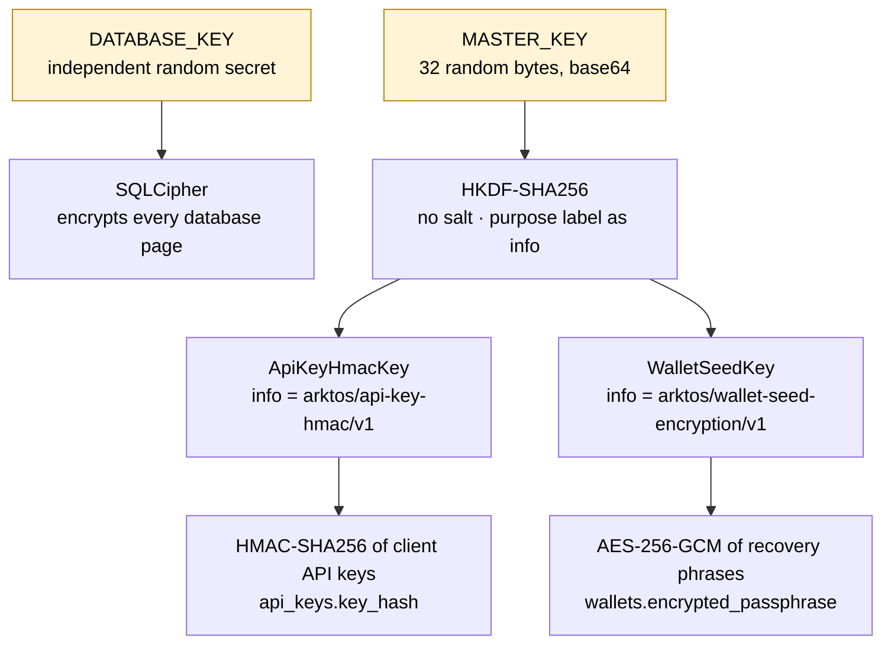

# C2 — Design key hierarchies

> **Cryptographic naming is part of persistent protocol design.**

**Question:** Arktos needs to authenticate API keys, encrypt recovery phrases and encrypt a database file. How many secrets should that take, how should they relate to each other, and what are you committing to when you name them?

## Mental model

A key hierarchy answers two separate questions:

1. **Compromise domains.** If one secret leaks, what else falls with it? Keys that are *independently generated* fail independently. Keys that are *derived* from a common root fall together whenever the root falls.
2. **Domain separation.** Can a key made for purpose A ever be used, by mistake or by an attacker, for purpose B? A KDF with distinct purpose labels gives each purpose a key that is cryptographically unrelated to the others, while you still store only one root.

Arktos uses both:



```text
DATABASE_KEY
    └── SQLCipher

MASTER_KEY
    └── HKDF-SHA256
          ├── arktos/api-key-hmac/v1           → ApiKeyHmacKey
          └── arktos/wallet-seed-encryption/v1 → WalletSeedKey
```

## In the code

| Concern | Where | What to notice |
|---|---|---|
| Purpose labels | [`src/keys.rs`](../../src/keys.rs) (`API_KEY_HMAC_INFO`, `WALLET_SEED_INFO`, marked `KEY-DOMAIN`) | Versioned (`/v1`), namespaced (`arktos/`), purpose-named |
| HKDF | `MasterKey::derive` in [`src/keys.rs`](../../src/keys.rs) | `Hkdf::<Sha256>::new(None, master)` then `expand(info, 32 bytes)`. The master key is already uniformly random, so no salt is used |
| Purpose types | `ApiKeyHmacKey`, `WalletSeedKey`, `Keyring` in [`src/keys.rs`](../../src/keys.rs) | One Rust type per purpose. Neither exposes its bytes. `WalletSeedKey` only hands out an `AeadKey` |
| Who gets which key | `serve()` in [`src/main.rs`](../../src/main.rs) | `KeyServices` receives only `keyring.api_keys`, and `WalletServices` receives only `keyring.wallet`. Neither service can reach the other's key |
| Independence check | `Config::from_lookup` in [`src/config.rs`](../../src/config.rs) | Startup fails if `DATABASE_KEY == MASTER_KEY` |
| SQLCipher keying | `open_connection` in [`src/database.rs`](../../src/database.rs) | `PRAGMA key` is the first statement, a real read verifies the key, and startup refuses to run on non-SQLCipher SQLite |

### Why `DATABASE_KEY` is not derived from `MASTER_KEY`

It would be simpler to derive a third HKDF subkey for SQLCipher, but the two roots protect against **different exposures**:

- SQLCipher protects the **file**: a copied disk, a stolen backup or a leaked volume snapshot.
- Field encryption protects the **recovery phrase inside an opened database**: someone with a SQL console, a database dump or `DATABASE_KEY` sees only envelopes.

If both came from one root, anyone holding that root would defeat both layers at once, and the second layer would protect against nothing the first one doesn't. Generating them independently means an operator can, for example, hand `DATABASE_KEY` to a DBA who runs backups and migrations without that person ever being able to decrypt a wallet. This is **two compromise domains**. It is not "twice the strength of AES-256". The [case study](CASE-STUDIES.md#why-database_key-is-independent-from-master_key) covers the trade-off.

### Why purpose-specific Rust types

HKDF already makes the two subkeys cryptographically unrelated. The types prevent a different failure: a *programmer* passing the right bytes to the wrong function. In Arktos that mistake does not compile. [`src/keys.rs`](../../src/keys.rs) has a `compile_fail` doctest on `Keyring` showing that `crypto::seal(&keyring.api_keys.hmac, …)` is rejected with `E0308`. The [case study](CASE-STUDIES.md#why-key-purposes-have-rust-types) has the details.

## Experiments

All of these are tests. Nothing here prints key material: the tests use fixed, synthetic master keys (`[0x11; 32]`, `[0x22; 32]`).

### Observe

```bash
cargo test --lib keys::tests
```

| Property | Test |
|---|---|
| Same master + same purpose → same key | `derivation_is_deterministic` |
| Same master + different purpose → different keys, neither equal to the master | `purposes_derive_independent_keys` |
| Different master → different key | `different_context_or_master_gives_different_key` |
| A wallet envelope opens only under its own purpose label: neither a `v2` label nor the HMAC label opens it | `existing_ciphertext_opens_only_with_its_own_purpose_label` |
| The derived wallet key equals an independently computed HKDF output (pinned) | `derived_subkeys_are_pinned` |
| Subkey derivation uses the RFC 5869 construction | `hkdf_matches_rfc5869_test_case_3` |

Also run the purpose-type doctest:

```bash
cargo test --doc keys::Keyring
```

### Predict

You are about to change `WALLET_SEED_INFO` from `arktos/wallet-seed-encryption/v1` to `arktos/wallet-seed-encryption/v2`. Before running anything, predict:

1. How many tests will fail?
2. Will the end-to-end tests that create a wallet and derive an address (`tests/secret_storage_tests.rs`, `tests/mcp_protocol_tests.rs`) fail?
3. What would happen to a production database the moment the new binary starts?

### Break

```bash
sed -i.bak 's|wallet-seed-encryption/v1"|wallet-seed-encryption/v2"|' src/keys.rs
cargo test --no-fail-fast
mv src/keys.rs.bak src/keys.rs   # restore
```

### Inspect

Exactly two tests fail: `derived_subkeys_are_pinned` and `existing_ciphertext_opens_only_with_its_own_purpose_label`. **Every integration test passes.** A test that creates a wallet and then reads it back is self-consistent: it seals and opens under the same new label, so it never notices that the label changed. Only tests that **pin** the derivation against an independent value catch the break.

In production nothing would fail at startup. The server starts and serves every **already-derived** address from its public `accounts` row. Then the first request for a new index fails with an opaque `internal error`, because the existing envelope no longer opens. Changing `API_KEY_HMAC_INFO` instead would be worse and immediate: every client API key stops verifying, and every agent gets `401`.

### Explain

Answer in two sentences: **is changing an HKDF label "just a refactor"?**

No. The label is an input to the key that protects data at rest. Changing it changes the key, so it is a **cryptographic data-compatibility change**. Every existing ciphertext and HMAC has to be migrated, re-issued or abandoned. That is why the labels carry `/v1`: when a new purpose version is needed, it is introduced *beside* the old one, and data moves between them deliberately. [Challenge 3](CHALLENGES.md#challenge-3--rotate-wallet-encryption-keys) asks you to design that move.

## Failure mode

- One key for two purposes, for example HMACing API keys with the same bytes that encrypt seeds. A weakness or a misuse in one purpose then becomes a weakness in the other.
- Deriving every root from one secret "for convenience", which collapses independent compromise domains into one.
- Treating purpose labels as cosmetic strings that a refactor may rename.

## Takeaway

> Cryptographic naming is part of persistent protocol design.

## Related reference

- [Architecture — Key Hierarchy & Secret Storage](../architecture.md#key-hierarchy--secret-storage)
- [Deployment Guide — Generating Secrets](../deployment-guide.md#generating-secrets)
- [Case studies: independent `DATABASE_KEY`](CASE-STUDIES.md#why-database_key-is-independent-from-master_key), [purpose types](CASE-STUDIES.md#why-key-purposes-have-rust-types), [HMAC vs encryption](CASE-STUDIES.md#why-api-keys-are-hmac-hashed-rather-than-encrypted)

Previous: [C1](01-model-cryptographic-authority.md) · Next: [C3 — Encryption is a data format](03-encryption-is-a-data-format.md)
