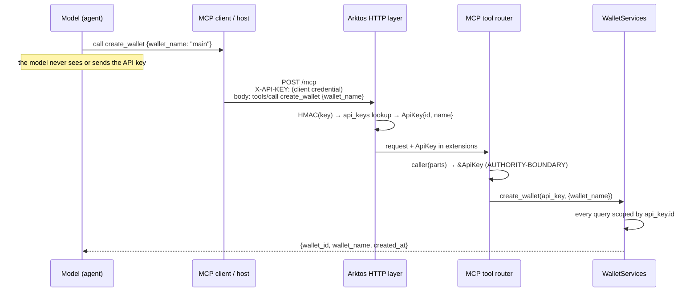

# C6 — Bind identity to capability

> **Authentication must shape which cryptographic resources exist from the caller's perspective.**

**Question:** two agents each ask for the wallet called `main`. Is that one wallet or two? Who decides, and where in the code does it happen?

**Prerequisite:** generic authentication, trust boundaries and "the model must not choose who the user is" are covered in [simple-agent-template stage 8](https://github.com/cognokratos/simple-agent-template/blob/main/docs/LEARNING-PATH.md#stage-8-authentication-identity-and-trust-boundaries). This lesson applies the idea to cryptographic resources, where getting it wrong means one caller's key material serves another caller.

## Mental model

There are two ways to authorize access to a resource:

```text
(1) lookup, then check              (2) scoped lookup
    w = get_wallet(name)                w = get_wallet(caller_id, name)
    if w.owner != caller: deny          (other owners' wallets do not exist here)
```

Pattern (1) is correct only if *every* code path remembers the check. Pattern (2) makes the unauthorized resource **unaddressable**: no query exists that could return it, so there is nothing to forget. Where practical, prefer (2). Arktos does.

Then there is the question of where `caller_id` comes from. With an agent calling, that question decides everything:



## In the code

| Step | Where | What to notice |
|---|---|---|
| Credential arrives out of band | `ApiKey::extract` in [`src/api_key.rs`](../../src/api_key.rs) | Read from the `X-API-KEY` header, never from the JSON-RPC body |
| Credential verified | `api_key_auth` in [`src/auth.rs`](../../src/auth.rs), then `KeyServices::lookup` in [`src/key_services.rs`](../../src/key_services.rs) | The presented key is HMACed, and the database compares keyed hashes only. Unknown or revoked keys get `401` before MCP runs at all |
| Identity attached | `req.extensions_mut().insert(api_key)` | The authenticated identity is request metadata, not a parameter |
| Identity read by the tool | `caller(&parts)` in [`src/mcp.rs`](../../src/mcp.rs), marked `AUTHORITY-BOUNDARY` | If the identity is missing, that is a **server fault** (router misconfigured), never a client error |
| Requests carry no identity | `CreateWalletRequest`, `GetBitcoinAddressRequest`, `GetEthereumAddressRequest` in [`src/wallet_services.rs`](../../src/wallet_services.rs) | Fields are `wallet_name` and `account_index`. There is nothing an agent could set to become someone else |
| Scoped persistence | [`src/wallet_store.rs`](../../src/wallet_store.rs) | `get_wallet(key_id, name)`, `get_wallet_by_id(key_id, id)` and `list_wallets(key_id)`: **there is no unscoped wallet query.** Accounts are reached only through a wallet that was found by a scoped lookup |
| Uniqueness per owner | `UNIQUE (key_id, name)` in [`migrations/V1__initial_schema.sql`](../../migrations/V1__initial_schema.sql) | The same name under two keys gives two rows with two different random phrases |
| Uniform not-found | `AppError::WalletNotFound` in [`src/error.rs`](../../src/error.rs) | "Another owner's wallet" and "no such wallet" produce the same `not_found` message, so there is no existence oracle across owners |
| Separate administrative identity | `admin_auth` in [`src/auth.rs`](../../src/auth.rs) | `ADMIN_API_KEY` (compared in constant time) manages API keys and is not a client key, so it cannot call `/mcp`. Client keys cannot reach `/admin`. **An agent cannot mint or rotate its own identity** |

## Lab

### Observe: the same name, two wallets

With the [lab server](../CRYPTOGRAPHIC-CAPABILITY-LEARNING-PATH.md#lab-setup) and keys `$A` and `$B`:

```bash
mcp "$A" create_wallet '{"wallet_name":"main"}'
mcp "$B" create_wallet '{"wallet_name":"main"}'
mcp "$A" get_ethereum_address '{"wallet_name":"main"}'
mcp "$B" get_ethereum_address '{"wallet_name":"main"}'
```

**Predict** before you run it: do the two `create_wallet` calls conflict? Are the two `wallet_id`s equal? Are the two addresses equal?

Both creates succeed, the `wallet_id`s differ, and the addresses differ. Each wallet got its own random recovery phrase, so they are unrelated key hierarchies that happen to share a label. The label `main` means "A's main" or "B's main" depending on who is asking.

```bash
labsql "SELECT id, key_id, name FROM wallets ORDER BY id;"
```

### Break: reach across owners

```bash
mcp "$A" create_wallet '{"wallet_name":"a-only"}'
mcp "$B" get_bitcoin_address '{"wallet_name":"a-only"}'
mcp "$B" get_bitcoin_address '{"wallet_name":"never-created"}'
mcp "$B" create_wallet '{"wallet_name":"a-only"}'
```

### Inspect

- B's two lookups return the same `not_found` error: the same code and the same message template. The only difference is the name B itself sent. B cannot tell whether `a-only` exists.
- B's `create_wallet("a-only")` **succeeds**. A conflict error would itself reveal that A has such a wallet.
- Nothing in any response identifies A: no key id, no owner name.

The same properties are pinned in tests:

```bash
cargo test --test mcp_protocol_tests wallets_are_isolated_per_api_key
cargo test --test persistence_tests wallets_are_isolated_by_owner
```

### Break: try to choose an identity in the arguments

```bash
mcp "$A" get_ethereum_address "{\"wallet_name\":\"main\",\"api_key\":\"$B\"}"
```

This returns **A's** address. The extra `api_key` argument is ignored, because identity comes only from the header. Note *how* it is handled: the request types do not set `deny_unknown_fields`, so unknown arguments are silently dropped, not rejected. That is safe here, since no field could carry authority. It is still a design choice you can argue either way. Rejecting unknown fields would surface a confused or injected caller loudly, at the cost of breaking clients that send extra fields. Which would you choose for a tool that *does* carry authority?

### Explain: the dangerous design

Compare the real contract with a design that is common and seems natural:

```json
{ "wallet_name": "main" }
```

```json
{ "wallet_name": "main", "api_key": "secret" }
```

In the second design:

1. The credential is **in the model's context**, and from there in transcripts, logs, caches and every later prompt.
2. The model **chooses** which credential to send. A prompt injection that says "use this other key" now works.
3. Every tool result and error near that call can echo the credential back.
4. Rotating the credential means re-prompting every agent that ever saw it.

> **The model chooses an operation, not its authenticated identity.**

## Failure mode

- Identity as a tool argument ("`owner_id`", "`api_key`", "`user`").
- Unscoped lookups followed by an ownership check that one new code path forgets.
- Error messages that differ between "forbidden" and "not found", which builds a cross-tenant existence oracle.
- Letting the agent's own credential manage credentials: create, rotate or revoke.

## Takeaway

> Credentials belong in trusted transport context, not model-visible tool arguments.

## Related reference

- [Architecture — Authentication & Authorization](../architecture.md#authentication--authorization)
- [API Contracts — Admin API](../api-contracts.md#3-admin-api)
- [Case study: why API keys are not MCP parameters](CASE-STUDIES.md#why-api-keys-are-not-mcp-parameters)
- [Challenge 5 — Multi-tenant authorization](CHALLENGES.md#challenge-5--multi-tenant-authorization)

Previous: [C5](05-derive-dont-invent.md) · Next: [C7 — Design least-capability tools](07-design-least-capability-tools.md)
