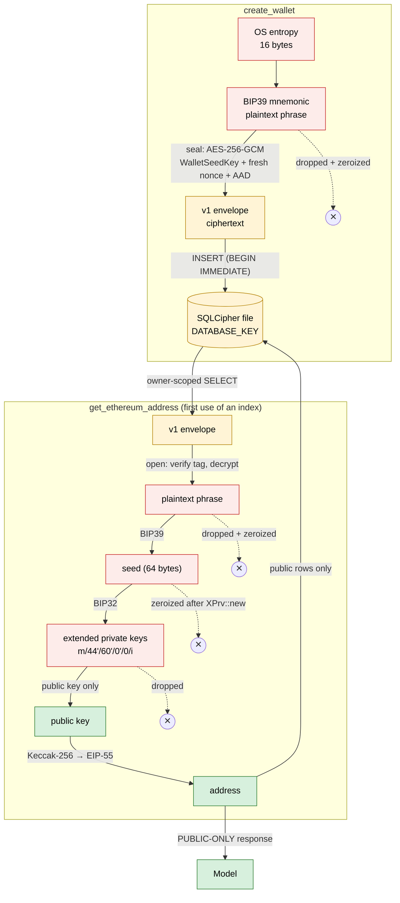

# Secret lifecycle walkthrough: follow one secret

Each CognoKratos track follows one unit of work through its system:

```text
simple-agent-template   → one request
sophos-agent            → one run
etf-research-agent      → one decision
arktos-wallet           → one secret
```

This walkthrough follows **one wallet recovery phrase** through the real code. It starts as 16 bytes of OS entropy in `create_wallet` and ends as a public Ethereum address returned by `get_ethereum_address`. At every step it records what exists, whether it is secret, where it lives, whether a model could ever see it, what protects it, and how long it lives.

Read it with [`src/wallet_services.rs`](../../src/wallet_services.rs), [`src/wallet_manager.rs`](../../src/wallet_manager.rs) and [`src/crypto.rs`](../../src/crypto.rs) open. **In the Arktos server request path, plaintext recovery phrases exist only inside the two regions marked `SECRET-BOUNDARY`.** That scope matters: the operator tool [`src/bin/secret.rs`](../../src/bin/secret.rs) (`make decrypt`) can deliberately decrypt and print a stored phrase. The agent has no such capability; the operator, who already holds `MASTER_KEY`, does. Capabilities are assigned by principal ([lesson 07](07-design-least-capability-tools.md#the-operator-has-capabilities-the-agent-does-not)).

"Dropped and zeroized" below means: Arktos drops the value and zeroizes the buffers it owns. Library-internal copies, such as `bip39::Mnemonic` and `bip32::XPrv` internals, follow their crates' own lifecycle, and nothing here guarantees erasure from memory ([what zeroization does not do](04-minimize-secret-lifetimes.md#what-zeroization-does-not-do)).



Red values are plaintext secrets, yellow values are secret-bearing but encrypted, and green values are public.

## Before the first request: the keys

When the server starts (`serve()` in [`src/main.rs`](../../src/main.rs)), `Config::from_env` parses `MASTER_KEY` into a `MasterKey` and refuses a `DATABASE_KEY` equal to it. `Keyring::new` derives `ApiKeyHmacKey` and `WalletSeedKey` with HKDF. `Database::new` keys SQLCipher with `DATABASE_KEY` and verifies it with a real read.

| Value | Secret? | Stored? | Visible to model? | Protected by | Lifetime |
|---|---:|---:|---:|---|---|
| `MASTER_KEY`, `DATABASE_KEY` (environment) | yes | no (operator's secret store) | no | host and process isolation | process lifetime, in the process environment |
| `WalletSeedKey`, `ApiKeyHmacKey` | yes | no | no | process isolation; `Zeroizing`; redacted `Debug` | process lifetime |
| SQLCipher page key | yes | no | no | inside SQLCipher | connection (process) lifetime |

---

## Part 1: creation (`create_wallet`)

### 1. The caller authenticates

`api_key_auth` reads `X-API-KEY`, HMACs it with `ApiKeyHmacKey` and looks up the hash. On success it attaches an `ApiKey { id, name }` to the request. The tool router reads it with `caller(&parts)`. The model sent only `{"wallet_name": "main"}`.

| Value | Secret? | Stored? | Visible to model? | Protected by | Lifetime |
|---|---:|---:|---:|---|---|
| Client API key | yes | only as HMAC | no (HTTP header from the MCP host) | TLS (in front of Arktos), HMAC at rest | one request (plain `String`, not zeroized) |
| `ApiKey { id, name }` | no | yes | no | n/a | one request |

### 2. The name is validated and checked within the owner's scope

`WalletName::parse` rejects empty names, names over 255 characters, surrounding whitespace and control characters. `store.get_wallet(api_key.id, name)` provides a friendly early `already_exists`. The `UNIQUE (key_id, name)` constraint is the authoritative, race-safe check.

| Value | Secret? | Stored? | Visible to model? | Protected by | Lifetime |
|---|---:|---:|---:|---|---|
| Wallet name | no | yes | yes (the model chose it) | validation | permanent |

### 3. OS entropy is generated

`generate_recovery_passphrase` fills a `Zeroizing<[u8; 16]>` from `getrandom`. That is 128 bits, the BIP39 12-word strength.

| Value | Secret? | Stored? | Visible to model? | Protected by | Lifetime |
|---|---:|---:|---:|---|---|
| Entropy | **yes** | no | no | `Zeroizing` | until the function returns |

### 4. The BIP39 mnemonic is created

`Mnemonic::from_entropy` builds the mnemonic: 128 bits plus a 4-bit checksum, encoded as 12 words.

| Value | Secret? | Stored? | Visible to model? | Protected by | Lifetime |
|---|---:|---:|---:|---|---|
| `bip39::Mnemonic` | **yes** | no | no | process isolation only: **library-owned, not zeroized** in this build | until the function returns |

### 5. The plaintext recovery phrase exists

The mnemonic is formatted into a `Zeroizing<String>` that was pre-sized to `MAX_PHRASE_LEN`, so formatting cannot reallocate and leave a stray copy. It is wrapped as `RecoveryPhrase`, whose `Debug` prints `RecoveryPhrase([REDACTED])`.

| Value | Secret? | Stored? | Visible to model? | Protected by | Lifetime |
|---|---:|---:|---:|---|---|
| Plaintext phrase | **yes** | no | no | `Zeroizing`; redacted `Debug` | the creation `SECRET-BOUNDARY` block |

### 6. The purpose-specific key is selected

`self.keys.seed.aead()`. `WalletServices` holds only `WalletKeys`. It *cannot* reach the API-key HMAC key, and a wrong-purpose key would not compile ([lesson 02](02-design-key-hierarchies.md#why-purpose-specific-rust-types)).

| Value | Secret? | Stored? | Visible to model? | Protected by | Lifetime |
|---|---:|---:|---:|---|---|
| `AeadKey` (purpose `wallet-seed`) | yes | no | no | type system; `Zeroizing`; redacted `Debug` | process lifetime (borrowed here) |

### 7. A fresh nonce is generated

`crypto::seal` draws 12 bytes from `getrandom`, fresh for every encryption.

| Value | Secret? | Stored? | Visible to model? | Protected by | Lifetime |
|---|---:|---:|---:|---|---|
| Nonce | no (must be unique, need not be secret) | yes, inside the envelope | no | OS RNG uniqueness | permanent |

### 8. The phrase is sealed into a versioned envelope

AES-256-GCM encrypts the phrase bytes with AAD `arktos:v1:A256GCM:wallet-seed`. The output is `{"v":1,"alg":"A256GCM","nonce":"…","ct":"…"}`.

| Value | Secret? | Stored? | Visible to model? | Protected by | Lifetime |
|---|---:|---:|---:|---|---|
| Encrypted envelope | secret-*bearing* | not yet | no | `WalletSeedKey` (AES-256-GCM with tag and AAD) | until persisted |

### 9. The plaintext phrase is dropped and zeroized

The `SECRET-BOUNDARY` block ends. `phrase` drops, its buffer is overwritten, and the block evaluates to the envelope `String`. **This happens before the database write starts**, so a slow or failing write never holds a plaintext phrase.

| Value | Secret? | Stored? | Visible to model? | Protected by | Lifetime |
|---|---:|---:|---:|---|---|
| Plaintext phrase | yes | **no** | no | n/a | **ended**: Arktos-owned buffer zeroized (subject to the [zeroization limits](04-minimize-secret-lifetimes.md#what-zeroization-does-not-do)) |

### 10. The ciphertext is persisted inside SQLCipher

`WalletStore::create_wallet` runs an `INSERT … RETURNING` inside `BEGIN IMMEDIATE`. SQLCipher encrypts the pages, the commit appends to the encrypted `-wal` file, and `synchronous = FULL` fsyncs it.

| Value | Secret? | Stored? | Visible to model? | Protected by | Lifetime |
|---|---:|---:|---:|---|---|
| `wallets.encrypted_passphrase` | secret-bearing | **yes** | no | `WalletSeedKey` **and** SQLCipher (`DATABASE_KEY`), which are independent | permanent |

### 11. Only public data is returned

`CreateWalletResponse { wallet_id, wallet_name, created_at }`. The tool description itself says the phrase is never returned.

| Value | Secret? | Stored? | Visible to model? | Protected by | Lifetime |
|---|---:|---:|---:|---|---|
| Wallet id, name, timestamp | no | yes | **yes** | n/a | permanent |

---

## Part 2: derivation (`get_ethereum_address`, first use)

### 12. The caller authenticates again

This is a new, independent HTTP request. The MCP layer is stateless, so nothing links it to the creation request except the persistent database. The authentication is the same as in step 1.

| Value | Secret? | Stored? | Visible to model? | Protected by | Lifetime |
|---|---:|---:|---:|---|---|
| `ApiKey { id, name }` | no | yes | no | HMAC lookup | one request |

### 13. The wallet lookup is scoped to the owner

`store.get_wallet(api_key.id, name)` either finds the caller's wallet or returns `not_found`. Another owner's wallet with the same name is unaddressable ([lesson 06](06-bind-identity-to-capability.md)). The returned `Wallet` record **includes the encrypted envelope**, so the envelope is loaded on every call, even when step 14 then returns early. `Wallet`'s `Debug` redacts it.

| Value | Secret? | Stored? | Visible to model? | Protected by | Lifetime |
|---|---:|---:|---:|---|---|
| Encrypted envelope (in memory) | secret-bearing | yes | no | `WalletSeedKey`; redacted `Debug` | one request |

### 14. An already-derived account short-circuits

`store.get_account(wallet.id, Network::Ethereum, index)` runs next. If a row exists, the service returns it **and decrypts nothing**: no plaintext secret material is produced. Steps 15–22 happen only on the first use of each (wallet, network, index). The server logs `Deriving new account` exactly when they do.

| Value | Secret? | Stored? | Visible to model? | Protected by | Lifetime |
|---|---:|---:|---:|---|---|
| Stored account row | no | yes | becomes the response | n/a | permanent |

### 15. The envelope is opened temporarily

`crypto::open` checks the version, the strict envelope shape, `alg`, the nonce length and the minimum ciphertext length. Then AES-256-GCM verifies the tag and decrypts. Every authentication failure is reported as `DecryptionFailed`, which becomes an opaque `internal error` over MCP.

| Value | Secret? | Stored? | Visible to model? | Protected by | Lifetime |
|---|---:|---:|---:|---|---|
| Decrypted bytes | **yes** | no | no | `Zeroizing<Vec<u8>>` | the derivation `SECRET-BOUNDARY` block |

### 16. The bytes become a `RecoveryPhrase` without copying

`RecoveryPhrase::from_utf8` *moves* the buffer into a `Zeroizing<String>`. If the bytes are not valid UTF-8, it zeroizes them before returning the error.

| Value | Secret? | Stored? | Visible to model? | Protected by | Lifetime |
|---|---:|---:|---:|---|---|
| Plaintext phrase | **yes** | no | no | `Zeroizing`; redacted `Debug` | the derivation block |

### 17. The BIP39 seed is derived

`Mnemonic::parse_normalized` parses the phrase, with a library-owned copy. `to_seed("")` runs PBKDF2-HMAC-SHA512 with the **empty** BIP39 passphrase, so Arktos does not use a "25th word". The 64-byte result goes straight into `Zeroizing`.

| Value | Secret? | Stored? | Visible to model? | Protected by | Lifetime |
|---|---:|---:|---:|---|---|
| `bip39::Mnemonic` (parsed copy) | **yes** | no | no | process isolation only: **library-owned, not zeroized** in this build | until the seed block ends |
| Seed | **yes** | no | no | `Zeroizing` | until the next step |

### 18. The BIP32 root key is created and the seed zeroized

`XPrv::new(seed)` creates the root key. Then `drop(seed)` runs. The seed is the shortest-lived secret in the system.

| Value | Secret? | Stored? | Visible to model? | Protected by | Lifetime |
|---|---:|---:|---:|---|---|
| Master extended private key | **yes** | no | no | process isolation; dropped on reassignment (chain codes are [library-owned](04-minimize-secret-lifetimes.md#what-zeroization-does-not-do)) | until the first child is derived |

### 19. The chain-specific path is derived

`Network::Ethereum.derivation_path(index)` gives `m/44'/60'/0'/0/{index}`. Each `derive_child` replaces `xprv`.

| Value | Secret? | Stored? | Visible to model? | Protected by | Lifetime |
|---|---:|---:|---:|---|---|
| Intermediate and account extended private keys | **yes** | **no** | no | process isolation; crate-specific wiping (`bip32`/`k256`) | one derivation step each; the account key until step 20 |
| Derivation path | no | yes | yes | DB `CHECK` constraint | permanent |

### 20. The public key is extracted and the private hierarchy dropped

`xprv.public_key().to_bytes()` produces the 33-byte compressed public key. `drop(xprv)` follows immediately. **The account private key is not extracted into an Arktos variable of its own**; it exists only inside the library's `XPrv` until that is dropped.

| Value | Secret? | Stored? | Visible to model? | Protected by | Lifetime |
|---|---:|---:|---:|---|---|
| Account private key | yes | no | no | n/a | **ended** |
| Public key | no | yes | yes | n/a | permanent |

### 21. The address is encoded

`derive_ethereum_address` takes Keccak-256 over the uncompressed key without its prefix and keeps the last 20 bytes, as canonical lowercase hex. For Bitcoin, `derive_bitcoin_address` applies the BIP86 Taproot tweak and bech32m encoding for the configured network.

| Value | Secret? | Stored? | Visible to model? | Protected by | Lifetime |
|---|---:|---:|---:|---|---|
| Address | no | yes | yes | n/a | permanent |

### 22. The phrase is dropped and zeroized

The derivation `SECRET-BOUNDARY` block ends. Only `AccountData { derivation_path, public_key, address }` leaves it.

| Value | Secret? | Stored? | Visible to model? | Protected by | Lifetime |
|---|---:|---:|---:|---|---|
| Plaintext phrase | yes | no | no | n/a | **ended** |

### 23. Only public account data is persisted

`WalletStore::insert_account` inserts with `ON CONFLICT DO NOTHING`, re-reads the row, and fails with `CorruptData` if a concurrent row disagrees with this derivation. Derivation is deterministic, so two racing requests must agree.

| Value | Secret? | Stored? | Visible to model? | Protected by | Lifetime |
|---|---:|---:|---:|---|---|
| `accounts` row (chain, network, index, path, public key, address) | no | yes | yes | SQLCipher at rest; `CHECK` and `UNIQUE` constraints | permanent |

### 24. Only public data is returned to the MCP caller

`eip55_checksum` is applied on the way out, and the configured `chain_id` is attached. The result is `EthereumAddressResponse`, one of the `PUBLIC-ONLY` types.

| Value | Secret? | Stored? | Visible to model? | Protected by | Lifetime |
|---|---:|---:|---:|---|---|
| EIP-55 address, path, public key, index, chain ID | no | yes (except the chain ID, which is configuration) | **yes** | n/a | permanent |

---

## Summary

| Value | Secret? | Stored? | Model-visible? | Protected by | Lifetime |
|---|---:|---:|---:|---|---|
| Entropy | yes | no | no | `Zeroizing` (Arktos-owned) | one function call |
| `RecoveryPhrase` formatted string | yes | no | no | `Zeroizing`, redacted `Debug` (Arktos-owned) | a creation or derivation `SECRET-BOUNDARY` block |
| `bip39::Mnemonic` internal representation | yes | no | no | process isolation only: library-owned, **not guaranteed zeroized** | inside a creation or derivation block |
| Encrypted envelope | secret-bearing | yes | no | `WalletSeedKey` + SQLCipher | permanent |
| BIP39 seed | yes | no | no | `Zeroizing` (Arktos-owned) | microseconds |
| BIP32 `XPrv` and intermediate private material | yes | no | no | process isolation; library-owned, crate-specific wiping | one derivation |
| Account private key | yes | **not persisted** | no | not extracted from `XPrv`, not returned | one derivation |
| Public key, path, address | no | yes | yes | n/a | permanent |
| `MASTER_KEY`-derived subkeys | yes | no | no | process isolation | process lifetime |

Three facts make the design work:

1. **Exactly one wallet secret is persisted**: the encrypted phrase. Every other wallet secret is re-derived when it is needed and dropped afterwards, its lifetime intentionally shortened.
2. **On the server request path, the plaintext exists only inside two code blocks**, and neither block can return anything secret, because the values they evaluate to are a ciphertext `String` and the public `AccountData`.
3. **A repeat call decrypts nothing**: it loads the envelope but produces no plaintext secret material.

## Questions

1. Step 13 loads the envelope even when step 14 is about to return early. Is that a problem? What would change if the account check ran first, and why does the current order not leak anything?
2. Where is the *longest-lived* plaintext secret in this walkthrough? (Hint: it is not the phrase.)
3. If you added a `sign_transaction` tool, which of steps 15–22 would it share? Which new step would sit between 19 and 20? How would the summary table change? See [Challenge 1](CHALLENGES.md#challenge-1--design-safe-transaction-signing).

Previous: [C8](08-recovery-is-part-of-security.md) · Next: [Case studies](CASE-STUDIES.md)
